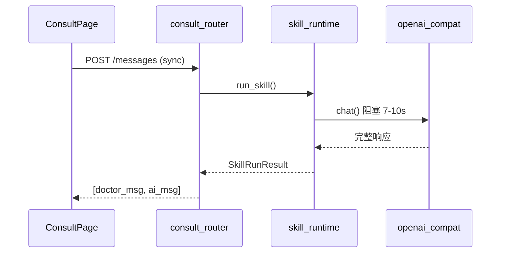
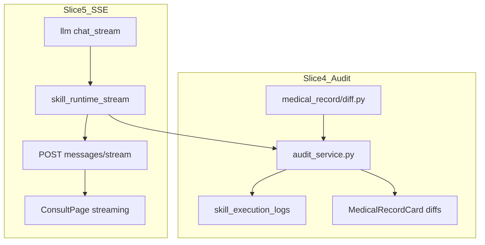

# Slice 5 → Slice 4 实施计划

## 当前基线（Slice 3 已完成）

- 问诊发消息走 [`backend/app/routers/consult.py`](backend/app/routers/consult.py) → [`backend/app/services/skill_runtime.py`](backend/app/services/skill_runtime.py)
- 病历结构化：`run_medical_record_skill()` in [`backend/app/medical_record/service.py`](backend/app/medical_record/service.py)，结果写入 `ConsultMessage.meta_json`
- LLM 同步调用：[`backend/app/services/llm/openai_compat.py`](backend/app/services/llm/openai_compat.py) 仅 `chat()`，无 stream
- 前端同步 `fetch`：[`frontend/src/api.ts`](frontend/src/api.ts) `sendMessage()` + [`frontend/src/pages/ConsultPage.tsx`](frontend/src/pages/ConsultPage.tsx)



---

## 阶段一：Slice 5 — SSE 流式（优先）

### 目标

- 普通问诊：token 级流式输出，医生侧即时看到打字效果
- 病历结构化：流式阶段显示「生成中」状态，JSON 完整后一次性推送 `structured` 事件（GLM `json_object` 无法边流边解析）
- **保留**现有 `POST /api/consult/{slug}/messages` 作为 fallback

### 5.1 后端 — LLM Stream Provider

**改动文件：**

- [`backend/app/services/llm/base.py`](backend/app/services/llm/base.py)：新增 `chat_stream(messages) -> Iterator[str]`
- [`backend/app/services/llm/openai_compat.py`](backend/app/services/llm/openai_compat.py)：
  - `httpx` 改用 `stream=True`，解析 OpenAI SSE `data: {...}` 行
  - 支持 GLM：`stream: true`，忽略 `[DONE]`
  - `response_format=json_object` 时仍流式接收，但只在 buffer 完整后 yield
- [`backend/app/services/llm/mock_provider.py`](backend/app/services/llm/mock_provider.py)：按词/句切块 `yield`，模拟延迟
- [`backend/app/services/llm/factory.py`](backend/app/services/llm/factory.py)：透传 `chat_stream`

**配置（可选）：** [`backend/app/config.py`](backend/app/config.py) 增加 `llm_stream_enabled: bool = True`

### 5.2 后端 — 流式 Skill Runtime

**新增：** `backend/app/services/skill_runtime_stream.py`（或扩展现有 `skill_runtime.py`）

统一事件协议（SSE `event` + `data` JSON）：

| event | 含义 | data 示例 |
|-------|------|-----------|
| `doctor_message` | 医生消息已入库 | `{id, content, ...}` |
| `status` | 进度提示 | `{text: "正在整理病历..."}` |
| `chunk` | 文本增量 | `{delta: "..."}` |
| `structured` | 病历 JSON 就绪 | `{structured_data, field_diffs?, validation_warnings}` |
| `done` | 助手消息落库完成 | 完整 `MessageOut` |
| `error` | 失败 | `{message, fallback?}` |

**分支逻辑：**

- **自由文本**（非病历意图）：`chat_stream` → 累积 `content` → `done`
- **病历结构化**（`should_run_structured_medical_record`）：
  1. `status`：正在生成结构化病历
  2. 内部仍调用完整 JSON 流程（可复用 `run_medical_record_skill`，暂不拆成流式 JSON）
  3. `structured` + `chunk`（可选推送 markdown 摘要）
  4. `done`：写入 `ConsultMessage`，`message_type=medical_record`

> 说明：MVP 不在 Slice 5 做「字段级流式渲染」，避免 GLM JSON 半包解析复杂度；卡片在 `structured`/`done` 后一次性展示。

### 5.3 后端 — SSE 路由

**改动：** [`backend/app/routers/consult.py`](backend/app/routers/consult.py)

```python
@router.post("/{slug}/messages/stream")
async def send_message_stream(...):
    return StreamingResponse(event_generator(), media_type="text/event-stream")
```

- 复用现有 DB 逻辑：先存 doctor_msg，再流式生成 assistant
- 生成结束后 `commit`，与 sync 路径行为一致
- 响应头：`Cache-Control: no-cache`、`Connection: keep-alive`

### 5.4 前端 — 流式消费

**改动文件：**

- [`frontend/src/api.ts`](frontend/src/api.ts)：新增 `sendMessageStream(slug, content, skillId, callbacks)`
  - 使用 `fetch` + `ReadableStream`（比 `EventSource` 更适合 POST）
  - 解析 `event:` / `data:` 行
- [`frontend/src/pages/ConsultPage.tsx`](frontend/src/pages/ConsultPage.tsx)：
  - `handleSend` 默认走 stream
  - 乐观追加 doctor 气泡 + 空 assistant 占位（`streaming: true`）
  - `chunk` 追加文本；`structured` 切换为 `MedicalRecordCard` 骨架/loading → 完整数据
  - `done` 替换占位为最终消息（含 id）
  - stream 失败 → 自动 fallback 到 `sendMessage()`
- [`frontend/src/types.ts`](frontend/src/types.ts)：`Message` 增加 `streaming?: boolean`
- [`frontend/src/styles/index.css`](frontend/src/styles/index.css)：流式光标/生成中动画

**Vite 代理：** [`frontend/vite.config.ts`](frontend/vite/config.ts) 默认支持 SSE，无需改；若缓冲问题可加 `proxy.timeout` 注释说明。

### 5.5 Slice 5 验收标准

- 普通对话：首 token < 3s（GLM），UI 可见增量输出
- 「帮我输出病历」：先显示 status，~10s 后卡片完整出现
- sync 端点仍可用；stream 断线可 fallback
- 刷新页面后消息与 DB 一致

---

## 阶段二：Slice 4 — 审计日志 + 字段 diff

### 目标

- 每次 Skill 执行（尤其病历结构化）写入 **审计表**，可追溯输入/输出/模型/耗时
- **字段级 diff**：对比「生成值」vs「患者上下文+对话证据」，并在 [`ConsultPage`](frontend/src/pages/ConsultPage.tsx) 病历卡片 **内联展示**
- 为后续 Slice 6「医生确认入库」预留 `status` 字段

### 4.1 数据模型

**新增表：** `skill_execution_logs` in [`backend/app/models.py`](backend/app/models.py)

| 字段 | 类型 | 说明 |
|------|------|------|
| id | str | UUID |
| doctor_id | FK | 当前医生 |
| patient_id | FK | 患者 |
| skill_id | FK nullable | 使用的 Skill |
| consult_message_id | FK nullable | 关联 assistant 消息 |
| task_type | str | `realtime` / `scheduled` |
| user_input | Text | 医生本轮输入 |
| provider / model | str | LLM 信息 |
| latency_ms | int | 耗时 |
| status | str | `success` / `fallback` / `parse_error` |
| input_snapshot | Text | 患者上下文 + 对话摘要 JSON |
| raw_output | Text | LLM 原始输出 |
| structured_output | Text | 校验后 JSON |
| validation_warnings | Text | JSON 数组 |
| field_diffs | Text | JSON 数组（核心） |
| created_at | datetime | |

**迁移：** 扩展 [`backend/app/database.py`](backend/app/database.py) `migrate_schema()`（与 `meta_json` 同模式）

### 4.2 字段 Diff 引擎

**新增：** `backend/app/medical_record/diff.py`

```python
class FieldDiff(BaseModel):
    field: str          # chief_complaint
    label: str          # 主诉
    generated: str      # 模型输出
    source_value: str   # 患者档案/对话中的证据
    status: Literal["matched", "inferred", "missing", "conflict"]
    note: str = ""
```

**规则（MVP）：**

| 字段 | 证据来源 | matched | inferred | missing | conflict |
|------|----------|---------|----------|---------|----------|
| patient_name/age | Patient 表 | 一致 | - | - | 不一致 |
| chief_complaint | patient.chief_complaint + 对话 | 包含/一致 | 对话扩展 | 待补充 | 与档案矛盾 |
| auxiliary_exams | patient.completed_exams + 对话 | 子串匹配 | 对话有但未在档案 | 待补充 | 上下文无此检查 |
| present_illness | 对话摘录 | 有关键词 | 模型归纳 | 待补充 | - |
| 其余字段 | 对话 | 有证据 | 无证据但非待补充 | 待补充 | - |

将现有 [`post_validate_record()`](backend/app/medical_record/service.py) 的 warnings **重构为** `compute_field_diffs()` + `warnings_from_diffs()`，避免两套逻辑。

### 4.3 审计服务

**新增：** `backend/app/services/audit_service.py`

```python
def log_skill_execution(db, *, patient, skill, result, latency_ms, consult_message_id=None) -> SkillExecutionLog
```

**接入点：**

- sync：[`consult.py`](backend/app/routers/consult.py) `send_message` 在 `commit` 前/后写 log
- stream：[`consult.py`](backend/app/routers/consult.py) `send_message_stream` 在 `done` 事件前写 log
- 将 `field_diffs` 同步写入 `ConsultMessage.meta_json`（前端无需额外请求）

**meta_json 扩展结构：**

```json
{
  "type": "outpatient_medical_record",
  "structured_data": {...},
  "validation_warnings": [...],
  "field_diffs": [...],
  "audit_log_id": "uuid"
}
```

### 4.4 API（轻量）

**新增路由：** `backend/app/routers/audit.py`（可选，MVP 最小集）

- `GET /api/audit/logs?patient_id=&limit=20` — 列表（调试/质控用）
- `GET /api/audit/logs/{id}` — 详情含 raw_output

前端 Slice 4 **不新建页面**（按你的选择），仅内联卡片展示 diff。

### 4.5 前端 — 病历卡片内联 Diff

**改动：** [`frontend/src/pages/ConsultPage.tsx`](frontend/src/pages/ConsultPage.tsx) `MedicalRecordCard`

- 新增 props：`fieldDiffs?: FieldDiff[]`
- 每个 `record-field` 旁显示状态徽章：
  - `matched` 绿色勾
  - `inferred` 橙色「待核实」
  - `missing` 灰色「待补充」
  - `conflict` 红色「冲突」
- hover/点击展开 `source_value` 与 `note`

**改动：** [`frontend/src/types.ts`](frontend/src/types.ts) + [`backend/app/schemas.py`](backend/app/schemas.py) `MessageOut` 增加 `field_diffs: list`

### 4.6 Slice 4 验收标准

- 每次「帮我输出病历」产生 1 条 `skill_execution_logs`
- 卡片每个字段有 diff 状态；冲突/推断字段可看到证据来源
- 审计表含 raw_output、latency_ms，可供 PoC 抽检
- sync + stream 两条路径均写审计

---

## 依赖关系与文件触点



**串行顺序（你的选择）：**

1. Slice 5 完成并稳定 → 问诊体验可用
2. Slice 4 在 `done`/sync 回调处挂审计，扩展 diff 与卡片

**共享改动（两阶段都会碰）：**

- [`backend/app/routers/consult.py`](backend/app/routers/consult.py)
- [`backend/app/services/skill_runtime.py`](backend/app/services/skill_runtime.py)
- [`frontend/src/pages/ConsultPage.tsx`](frontend/src/pages/ConsultPage.tsx)
- [`backend/app/schemas.py`](backend/app/schemas.py) / [`frontend/src/types.ts`](frontend/src/types.ts)

---

## 工作量估算

| 阶段 | 后端 | 前端 | 合计 |
|------|------|------|------|
| Slice 5 | 1.5–2 天 | 0.5–1 天 | **2–3 天** |
| Slice 4 | 1–1.5 天 | 0.5 天 | **1.5–2 天** |

---

## 风险与对策

| 风险 | 对策 |
|------|------|
| GLM SSE 格式与 OpenAI 细微差异 | 封装统一 parser，加集成测试 |
| 病历 JSON 无法真正流式 | MVP 用 status + 完成后 structured 事件 |
| Vite 代理缓冲 SSE | 用 fetch stream；必要时 `X-Accel-Buffering: no` |
| 审计表膨胀 | MVP SQLite 可接受；后续 Phase 2 换 PostgreSQL + 归档 |
| Slice 5/4 合并冲突 | 先锁定 consult 路由接口契约，再并行改前后端 |

---

## 建议 Multitask 分工（串行 5→4 前提下）

若你 multitask 时仍想并行准备：

- **Track A（当前优先）**：Slice 5 全链路 — LLM stream → SSE route → ConsultPage
- **Track B（可提前设计）**：Slice 4 的 `diff.py` + `SkillExecutionLog` 模型 + `audit_service` 草稿，等 Slice 5 的 `done` 事件稳定后接入

不建议 Track B 先于 Track A 改 `consult.py` 主路径，避免流式合并时二次冲突。
